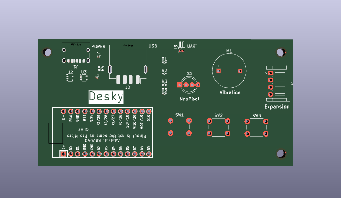
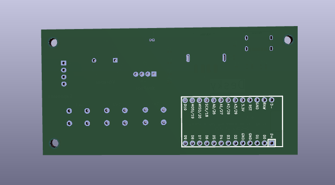

# Desky

Desky is an open-source macro pad that has expansion ports on 3 sides for easy customization. It not only looks great on your desk, but it also makes it easy to learn important programming and electronics skills.

# Design Files

The design files necessary to create Desky for yourself are included in the download
